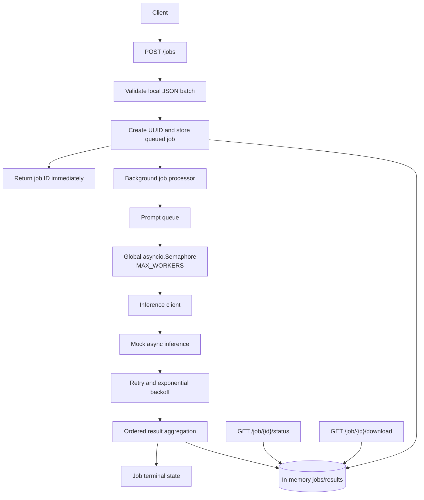

# Batch Inference Engine

## 1. Overview

The Batch Inference Engine is an asynchronous batch inference service built with FastAPI. A client submits a local JSON file containing prompts, immediately receives a job ID, and can later check job status or download ordered results.

Inference is currently mocked. The real inference endpoint, authentication mechanism, request format, and response format have not yet been provided.

## 2. Features

- Local JSON batch ingestion and validation
- Immediate UUID job creation
- Asynchronous/background job execution
- In-memory job tracking and result storage
- Code-level worker and retry configuration
- Globally bounded inference concurrency
- Ordered result aggregation
- Isolated per-prompt failure handling
- Retries with exponential backoff
- `completed`, `completed_with_errors`, and `failed` terminal states
- Job status endpoint
- JSON result download endpoint
- Pytest API test suite
- Environment-variable template for future configuration

## 3. Architecture



`POST /jobs` stores the job before scheduling background processing, so it can return without waiting for prompts to finish. Status and download requests read the in-memory job and result state.

## 4. Repository Structure

```text
app/
	__init__.py
	main.py
	inference_client.py
examples/
	sample_batch.json
tests/
	__init__.py
	test_api.py
.github/
	workflows/
		ci.yml
.env.example
.gitignore
requirements.txt
README.md
```

- `app/main.py`: FastAPI routes, job state, worker processing, retries, and result downloads.
- `app/inference_client.py`: Temporary async mock inference client.
- `examples/sample_batch.json`: Sample local prompt batch.
- `tests/test_api.py`: API, lifecycle, retry, failure, ordering, download, and concurrency tests.
- `.env.example`: Placeholder configuration for future inference integration.
- `requirements.txt`: Runtime and test dependencies.

GitHub Actions runs the pytest suite on pushes and pull requests.

## 5. Input Format

`examples/sample_batch.json` contains an array of prompt strings:

```json
[
	"Explain machine learning.",
	"What is batch inference?",
	"What is an API?"
]
```

The submission request supplies a path to a JSON file available to the service:

```json
{
	"file_path": "examples/sample_batch.json"
}
```

The file must exist, use the `.json` extension, contain a non-empty array, and contain only non-empty strings.

## 6. API

### `GET /health`

Returns a simple service health response.

```json
{
	"status": "running"
}
```

### `POST /jobs`

Validates the local batch file, creates an in-memory job, schedules processing, and returns immediately with HTTP `201 Created`.

Request:

```bash
curl -X POST http://127.0.0.1:8000/jobs \
	-H "Content-Type: application/json" \
	-d '{"file_path":"examples/sample_batch.json"}'
```

Response:

```json
{
	"job_id": "<generated-uuid>",
	"status": "queued",
	"total_prompts": 3
}
```

Invalid file paths, file types, JSON, or prompt content return HTTP `400`.

### `GET /job/{job_id}/status`

Returns the current counters and state for a known job.

```json
{
	"job_id": "<generated-uuid>",
	"status": "running",
	"total_prompts": 3,
	"completed_prompts": 2,
	"failed_prompts": 0
}
```

An unknown job ID returns HTTP `404`.

### `GET /job/{job_id}/download`

Returns stored results as JSON for a terminal job. The response includes a `Content-Disposition` attachment filename such as `job_<job_id>_results.json`.

```json
{
	"job_id": "<generated-uuid>",
	"status": "completed",
	"total_prompts": 3,
	"results": [
		{
			"prompt": "Explain machine learning.",
			"response": "mock response for: Explain machine learning.",
			"error": null
		}
	]
}
```

Downloads for queued or running jobs return HTTP `409`. Downloads for unknown jobs return HTTP `404`.

## 7. Job Lifecycle

Normal processing follows:

```text
queued -> running -> completed
```

The terminal alternatives are:

- `completed_with_errors`: at least one prompt succeeded and at least one failed permanently.
- `failed`: every prompt failed permanently.

Successful prompts increment `completed_prompts`; permanently failed prompts increment `failed_prompts`. A failure does not stop the rest of the batch.

## 8. Concurrency Design

`MAX_WORKERS` is the global maximum number of simultaneous inference operations. Each job may create its own processing tasks, but every inference call shares one global `asyncio.Semaphore`, so active inference calls cannot exceed `MAX_WORKERS` across the service.

## 9. Retry and Failure Handling

Each prompt is processed independently. Inference failures are retried up to `MAX_RETRIES` using exponential backoff beginning at `BASE_BACKOFF_SECONDS`. The global semaphore is held only while an inference call is active and is released during backoff.

After retries are exhausted, the prompt receives an error result while other prompts continue:

```json
{
	"prompt": "example prompt",
	"response": null,
	"error": "error message"
}
```

The retry helper currently uses generic exceptions. Real HTTP `429`/rate-limit handling can be connected when the real inference API contract is available.

## 10. Running Locally

Create and activate a virtual environment where appropriate:

```bash
python -m venv .venv
```

On Windows PowerShell:

```powershell
.venv\Scripts\Activate.ps1
```

Install dependencies and start the server:

```bash
pip install -r requirements.txt
uvicorn app.main:app --reload
```

FastAPI Swagger documentation is available at [http://127.0.0.1:8000/docs](http://127.0.0.1:8000/docs).

## 11. Running Tests

```bash
python -m pytest -q
```

The current suite covers the major API, validation, lifecycle, concurrency, retry, failure, ordering, and download flows. The test count may change as the project evolves.

## 12. Configuration

[`.env.example`](.env.example) documents these future configuration values:

```dotenv
INFERENCE_ENDPOINT=
INFERENCE_API_KEY=
MAX_WORKERS=5
MAX_RETRIES=3
BASE_BACKOFF_SECONDS=0.01
```

The current application does not load `.env` or `.env.example`; its worker and retry constants are defined in `app/main.py`. The example file contains placeholders only, and real `.env` files are ignored by `.gitignore`.

## 13. Current Limitation / Future Integration

The real inference request is intentionally not implemented because these details are still pending:

- Inference endpoint
- Authentication method
- Request schema
- Response schema

`app/inference_client.py` isolates this dependency so the temporary mock can later be replaced without redesigning the job-processing system.

## 14. Design Trade-offs

- In-memory job and result storage is simple for this exercise, but jobs disappear when the process restarts.
- The implementation is suitable for the current coding exercise; a production system could introduce durable job, result, and object storage later.
- Global bounded concurrency protects the downstream inference service from unbounded simultaneous calls.
- Results are stored at their original prompt indexes, preserving JSON result ordering even when prompts finish at different times.